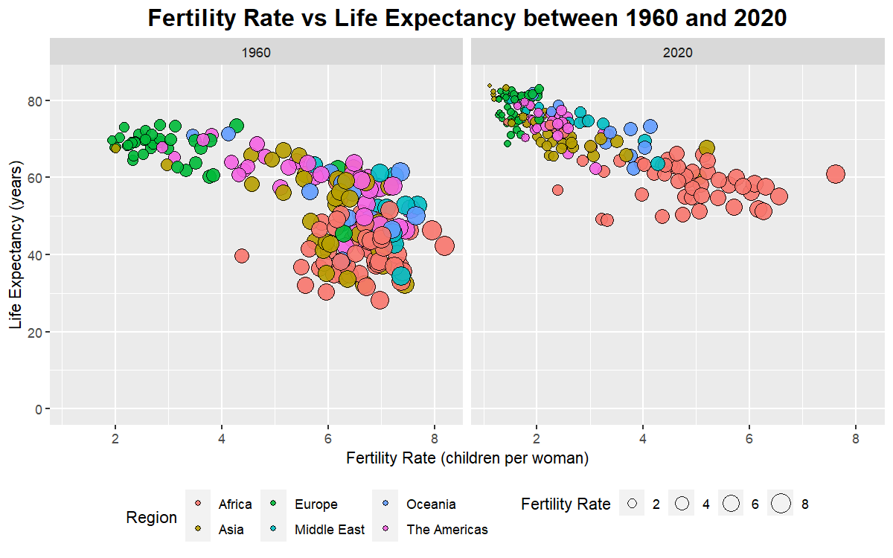
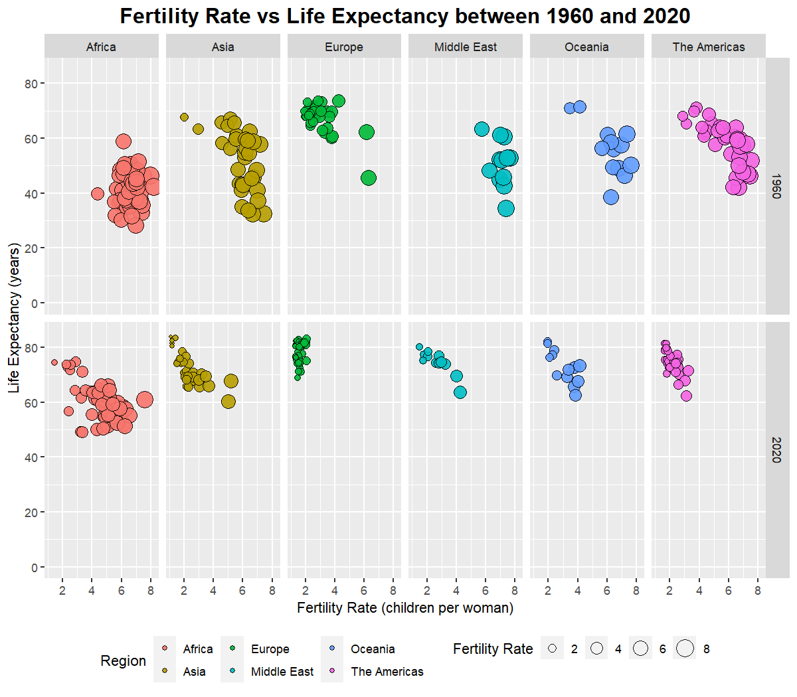
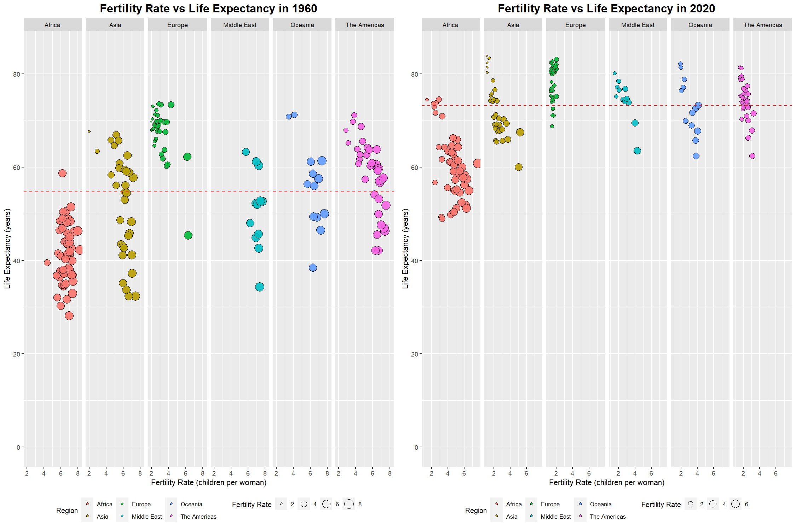

# Data-Analyst-at-World-Bank
Life Expectancy and Fertility Rate Statistics by Country in 1960 and 2020

## Description
A1_Assignment_Data_Analyst_at_World_Bank  
Bantugon, Michelle Kae Celine Jo-anne E.  
Hult International Business School  
DAT-5323: Visualizing & Analyzing Data with R: Methods & Tools  
Dr. Priyanka Shrivastava  
January 24, 2024  

### Part I. Instantiating & Merging Datasets

### Part II. Data Visualization

#### Graph 1

#### Graph 2

#### Graph 5

### Part III. Analysis and Insights

#### Introduction
#### Definition of Terms

Life Expectancy  
Life expectancy is defined as a statistical measure of how long a person may live, based on demographic factors such as gender, current age, and most importantly the year of their birth. The most commonly used measure of life expectancy is life expectancy at birth or at age zero (Statista, 2023).  

Total Fertility Rate  
Total fertility rate represents the number of children that would be born to a woman if she were to live to the end of her childbearing years and bear children in accordance with age-specific fertility rates of the specified year (United Nations Population Division, 2022).  

#### Analysis of Fertility Rate versus Life Expectancy between 1960 and 2020
#### Graph 1

Graph 1 illustrates the global trend in fertility rate and life expectancy across regions between 1960 and 2020. In 1960, an increase in fertility rate corresponds to a decrease in life expectancy. Conversely, in 2020, a decrease in fertility rate aligns with an increase in life expectancy, indicating a negative correlation. 

#### Graph 2

Graph 2 compares global fertility rates and life expectancy in 1960 and 2020. Europe consistently has the lowest fertility rate, concentrated between 1 to 2 in 2020, followed by America. Africa shows the lowest life expectancy in both years. Data variability is higher in 1960, suggesting regional variations in the correlation between variables, possibly influenced by factors beyond fertility rate.

#### Graph 3 and 4
Graph 3 and 4 are utilized to combine plots for 1960 and 2020, showcasing median life expectancy for both years in a side-by-side display.

#### Graph 5
Graph 5 displays the rise in median life expectancy from 54.699 years in 1960 to 73.25 years in 2020, as indicated by the red dashed line in both plots. In 1960, only Europe surpassed the median line, followed by America with over half of its data above the median. Africa consistently remained below the median. In 2020, despite Asia having less than half of its data above the median, it boasts the highest life expectancy among regions. Over 90% of Europeans now exceed the median, and the Middle East has seen an increase since 1960. However, Africa still lags below the median, with marginal improvement.

#### Conclusion
To establish a statistically significant negative correlation, additional data collection is essential. Exploring factors influencing both fertility and life expectancy, such as Gross Domestic Product(GDP), age, sex, income, population, healthcare, education, and economic development, will contribute to a more comprehensive analysis. It's crucial to note that negative correlations indicate a statistical tendency rather than causation.

### Part IV. References

* Licence badge from [Shields.IO](https://shields.io/)
* Ardiles, F. (November 2019). Correlation between Life Expectancy and Fertility.
 &nbsp;&nbsp;&nbsp;&nbsp;https://vox.lacea.org/?q=blog/life_expectancy_fertility
* Dyvik, E.H. (2024). Average life expectancy at birth in 2023, by continent and gender.
 &nbsp;&nbsp;&nbsp;&nbsp;https://www.statista.com/statistics/270861/life-expectancy-by-continent/
* Hebbali, A. (June 2021). Data Visualization with ggplot2.
 &nbsp;&nbsp;&nbsp;&nbsp;https://viz-ggplot2.rsquaredacademy.com/
* United Nations Population Division. (2022). Metadata Glossary.
 &nbsp;&nbsp;&nbsp;&nbsp;https://databank.worldbank.org/metadataglossary/millennium-development-goals/series/SP.DYN.TFRT.IN
___

Copyright © 2023 R – All Rights Reserved.  

